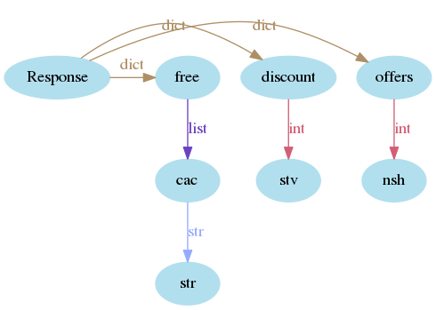

*no need of additional packages*

* **RUN** `python checkout.py`
* By default `test_run` function will be excute with the given sample test cases.
* `pricing_rules` format is followed as followed.
```
{
    "offer": {"item_name": ("count", "actual count")},
    "discount": {"tem_name": ("offer_count", "value")},
    "free": {"item_name": ["free item list"]},
}
```
* Sample `pricing_rules` gives as below as mentiond above format. Based on the given [**FILE**](./coding_assignment.pdf)
```
            {
                "offers": {"nsh": (3, 2)},
                "discount": {"stv": (4, 499.99)},
                "free": {"cac": ["mch"]},
            }
```
* Visual represtation of the `pricing_rules` structure


